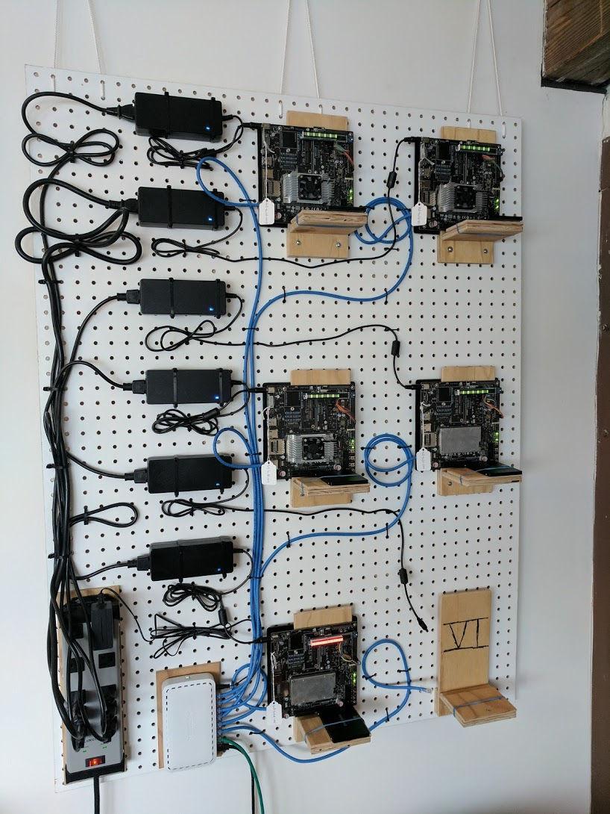

A Rust library & application for the [Adafruit Bi-Color (Red/Green) 24-Bar Bargraph w/I2C Backpack Kit](https://www.adafruit.com/product/1721).

Available on [Github](https://github.com/jasonpeacock/led-bargraph) and [crates.io](https://crates.io/crates/led-bargraph) as `led-bargraph`.

`led-bargraph` was developed as a learning exercise for the [Rust Programming Language](https://www.rust-lang.org/), and to add a visual "load" display to an ARM-based buildfarm that I assembled using a number of NVidia TX1 development boards:

Here, the LED bargraphs represent the current # of build tasks, you can see them laid horizontally across the top of each board as a series of green lights, or in the bottom board it is all red.

A cron is run locally on each development board and updates the LED bargraph via the `led-bargraph` application.
